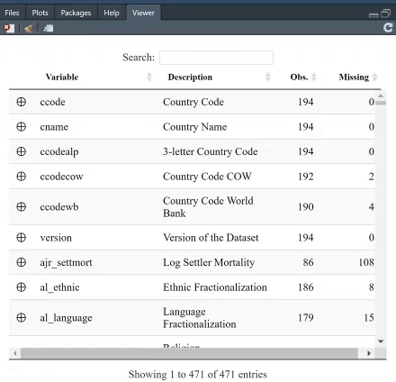

# varsExplore
Searchable variable explorer with labelled variables in RStudio's Viewer Pane



# Install

```r
devtools::install_github("vladtarko/varsExplore")
```
 
# Basic usage

```r
# import data
qog <- rio::import("http://www.qogdata.pol.gu.se/dataarchive/qog_std_cs_jan18.dta")

# create variable explorer in RStudio's View Pane
vars_explore(qog)
```

This will create a searchable variable explorer, and calculate summary statistics for each variable.

The table is searchable, and you can, furthermore, arrange it, say, based on which variable has least missing values. For instance, search for "GDP per capita" and see which variable provides most complete information.

If you click on the (+) next to a variable, you will get both the summary statistics, the unique values and, if present, the value labels. The option `value.labels.width` limits how many characters to include in the "Value
labels" and "Values" columns. Default is 500.

If you set `minimal = TRUE`, only "Variable", "Description", "Obs.", and "Missing" will be shown (and none the summary stats will be calculated).

```r
vars_explore(qog, minimal = TRUE)
```

If you set `silent = FALSE` the variable explorer will also return the dataframe of summary statistics.

```r
qog_summary <- vars_explore(qog, silent = FALSE)
```

This can be used to make summary statistics tables, e.g. for a paper.

# Acknowledgements

This was made possible by Reigo Hendrikson's `datatable2`:  <http://www.reigo.eu/2018/04/extending-dt-child-row-example/>

As far as I know, Reigo hasn't made this available in a package. It is included in this package, with some minor modifications, and you can use it with `varsExplore::datatable2()`. 
