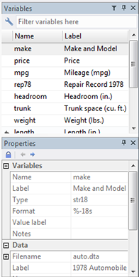

```{r, include = FALSE, paged.print=TRUE}
knitr::opts_chunk$set(
  collapse = TRUE,
  comment = "#>",
  message=FALSE, warning=FALSE
)
```

```{r setup}
library(varsExplore)
library(dplyr)
```

## Motivation

One of the things that _Stata_ has that _RStudio_ lacks is the variable explorer. This extremely useful especially if you're working with datasets with a large number of variables with hard to remember names, but descriptive labels. In _Stata_ you just search in the variable explorer and then click on the variable to get its name into the console. 

<div style = "margin: auto">



</div>

As an example of a dataset like this, consider the Quality of Government standard dataset. Here's the 2018 version of the cross-section data:

```{r}
qog <- rio::import("http://www.qogdata.pol.gu.se/dataarchive/qog_std_cs_jan18.dta")
```

It has 194 observations (different countries) and 1882 variables.

The variables have names like `wdi_acelu`, `bci_bci`, `eu_eco2gdpeurhab`, `gle_cgdpc` etc. Not exactly things you want to remember.

Working with this in _Stata_ is relatively easy because you just search in the variable explorer for things like "sanitation", "corruption", "GDP", etc. and you find the variable names.

Unfortunately, _RStudio_ doesn't have a variable explorer panel. But you can improvise something like the following:

```{r, eval=FALSE}
data.frame(Description = sjlabelled::get_label(qog)) %>% DT::datatable()
```

<div style = "width:50%; height:auto; margin: auto;">

```{r echo=FALSE}
data.frame(Description = purrr::map_chr(qog, ~attr(.x, "label"))) %>% DT::datatable()
```

</div>

BAM! We just made a variable explorer! If you run this code in the console it opens the `DT::datatable` in the RStudio's Viewer pane, which is pretty much replicating the Stata experience (except that it is read-only).

But we can do better! Why not include additional information, like the number of missing observations, summary statistics, or an overview of the values of each variable?

## Introducing `vars_explore`

### Full usage

```{r, eval = FALSE}
vars_explore(qog)
```

This will create a searchable variable explorer, and calculate summary statistics for each variable:


The table is searchable, and you can, furthermore, arrange it, say, based on which variable has least missing values. For instance, search for "GDP per capita" and see which variable provides most complete information.

If you click on the + next to a variable, you will get both the summary statistics, and unique values and, if present, the value labels. The option `value.labels.width` limits how many characters to include in the "Value
labels" and "Values" columns. Default is 500.

If you set `minimal = TRUE`, only "Variable", "Description", "Obs.", and "Missing" will be shown (and none the summary stats will be calculated).

### Creating summary statistics tables

By default, `vars_explore` only shows the summary in RStudio's Viewer Pane, and doesn't return anything. But you can change this by setting `viewer = FALSE` and `silent = FALSE`. This speeds it us massively because it's the `DT::datatable()` that takes most of the time, and allows you to build summary stats (e.g. for a paper):

```{r}
vdem_summary <- qog %>% 
  select(starts_with("vdem_")) %>%
  vars_explore(viewer = FALSE, silent = FALSE) %>% 
  select(-Values, -`Value labels`)

knitr::kable(vdem_summary)
```

You can also opt to use `View()` instead of the Viewer Pane, which works much faster than `DT::datatable()`, although, given how RStudio works, this makes hard to see both the variable explorer and your script at the same time.

## Alternatives

The best alternative to `vars_explore` is the `vtable` package. The downsides of `vtable` are 

(1) it doesn't provide a searchable table in the Viewer Pane, and 
(2) it puts all summary stats in a single text column. This makes it hard to sort based on, say, the number of missing values. 

You can, however, use `vtable` to generate a dataframe that can be opened with `View()`, just like you can with `vars_explore(silent = FALSE, viewer = FALSE)`. Unfortunately, what makes `vtable` faster is precisely its limitations, as the most time consuming part is loading up the `DT::datatable`, rather than calculating anything. `vtable` works fast because it creates a simple HTML file, but that is not searchable in the Viewer Pane.

Another alternative is `sjPlot::view_df`, which provides summary stats in individual columns, but it is _very_ slow. Also, like `vtable`, it doesn't provide a searchable table in the Viewer Pane. 

## Acknowledgements

This was made possible by Reigo Hendrikson's `datatable2`:  <http://www.reigo.eu/2018/04/extending-dt-child-row-example/>

As far as I know, Reigo hasn't made this available in a package. It is included in this package, with some minor modifications, and you can use it with `varsExplore::datatable2()`. 
